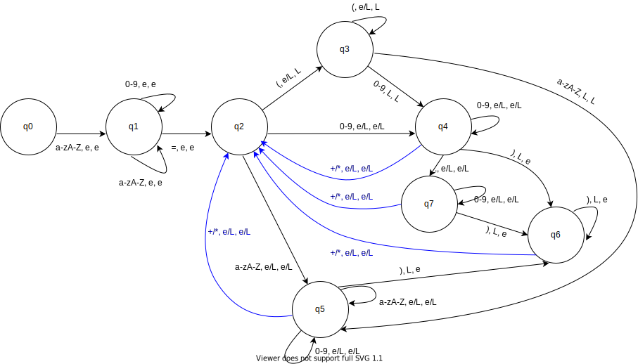

## Deterministic pushdown automation

### Input exemple
На вход подается любая комбинация состоящая из названия переменной, =, выражения 

**Пример (Example)**:
- variable=92+2
- variable=(9+2)*2
- variable=ABC+TAX
- variable=(ABC+2)*2
- variable=(2+((2+7)*PRICE2))*((TAX33X+2)*(6+TT))

### Список состояний (q)

В автомате есть **7** состояний из них **4** могут быть конечными
Ниже приведены все состояния с описаниями

1. **q0** - начальное состояние, осуществляет переход в состояние **q1** только в случае, если символ буква;
1. **q1** - промежуточное состояние, в котором автомат принимает либо цифры, либо буквы и осуществляет переход в новое состояние только при получении знака равенства
1. **q2** - состояние маршрутизатор, в это состояние возвращаются из состояний **q4**, **q5**, **q6** по арифметическому знаку "**+**" либо "<b>*</b>". 
   Переход из этого состояния возможен, по знаку скобки в состоние **q3** при этом на стек добавляется символ "(", по цифре в состояние **q4**, по буквеному символу в состояние **q5**
1. **q3** - состояние работает с открывающими скобками и кладет на стек символ "(". Переход из этого состояния возможен в состояние **q4** и **q5**.
1. **q4** - состояние работает с цифрами, переход из этого состояния возможен либо в **q2** по знаку "**+**" или "<b>*</b>", либо в **q6** по закрывающей скобке при этом со стека снимается одна открывающая скобка.
   Также возможен переход в состояние **q7** по точке. 
1. **q5** - состояние работает цифрами и буквами не трогая стек, переход из состояния возможен либо в **q2** по знаку "**+**" или "<b>*</b>", либо в **q6** по закрывающей скобке при этом со стека снимается одна открывающая скобка.
1. **q6** - состояние работает с закрывающими скобками и снимает со стека символ "(". Переход из состояния возможен в **q2** по знаку "**+**" или "<b>*</b>"
1. **q7** - состояние работает с цифрами, переход в состояние **q6** осуществляется по символу ")" при этом со стека снимается следующий символ "(". 
   Также возможен переход в состояние **q2** по знаку"**+**" или "<b>*</b>"

---

Состояния **q4**, **q5**, **q6**, **q7** могут быть конечными.
Автомат заканчивает работу в случае, если символы для обработки закончены и стек пуст.

#### В случае если передана недопустимая комбинация букв и цифр будет вызвана ошибка с помощью "raise"

#### На данной схеме работы автомата элемент "e" - пустой стек, "L" - левая скобка на стеке. Надпись e/L сделана для упрощения схемы.

## License

See the [LICENSE](LICENSE) file for license rights and limitations (MIT).
